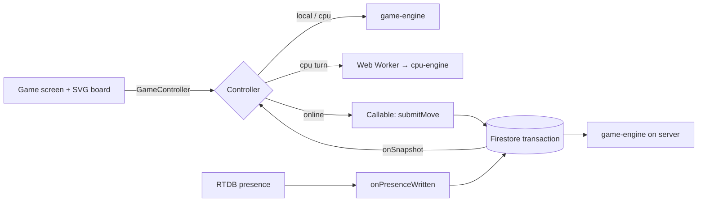

# Architecture

## One core game, three execution modes

Local, CPU and online games all use the same deterministic `GameState` and the same `applyMove`. The only thing that differs is **where authority lives**:

| Mode | Authority | Transport |
| --- | --- | --- |
| Local (2–4 humans) | Browser engine (`LocalController`) | none |
| CPU (1 human + 1–3 CPU) | Browser engine; CPU moves computed in a Web Worker (`CpuController`) | none |
| Online (2–4 humans) | Cloud Function `submitMove` inside a Firestore transaction (`OnlineController`) | Callable functions + Firestore listeners + RTDB presence |



The game screen, board and scoreboard only talk to the `GameController` interface (`apps/web/src/controllers/types.ts`). They never contain game rules.

## Packages

- **`@dots/game-engine`** has no dependencies. The engine never reads the clock or `Math.random` (ESLint enforces this), so it is deterministic and can replay games. Edge IDs are `H-r-c` / `V-r-c` and cell IDs are `C-r-c`. `applyMove` returns `{ gameState, completedCells, scoreGained, extraTurn, gameOver }` or a typed error. On the final cell it finishes the game before any turn advance.
- **`@dots/cpu-engine`** converts state to a compact typed-array model.
  - *Easy*: usually captures, prefers safe moves, makes seeded mistakes.
  - *Medium*: always captures, avoids third sides, gives away the smallest chain.
  - *Hard*: parity heuristic for safe moves, long-chain/double-dealing control, "hard-hearted" handouts, and an exact memoised endgame solver for 2-player positions with ≤16 free edges.

  Every choice is checked against `isValidMove`.
- **`@dots/protocol`** holds the zod request schemas used by both the functions (validation) and the client (types), plus Firestore document types, error codes and messages.

## Online data model

```
rooms/{roomId}                 lobby + live mirror (status, playerUids, currentPlayerUid, totalMoves, expiresAt TTL)
rooms/{roomId}/players/{uid}   name, colour, ready, connected, disconnectedAt
roomCodes/{code}               active code → roomId (unique, deleted when the game starts)
games/{gameId}                 authoritative GameState + seq + memberUids (kept as history)
games/{gameId}/moves/{seq}     accepted moves; zero-padded id = order; clientMoveId for idempotency
playerStats/{uid}              server-written stats
rateLimits/{uid}_{action}      token buckets
RTDB /status/{roomId}/{uid}    online/offline presence;  /rooms/{roomId}/members/{uid} for RTDB rules
```

The PDF's `rooms/{roomId}/moves` is not used: moves live only under `games/`, so the history outlives the room.

### `submitMove` (authoritative, atomic)

Everything below happens in one Firestore transaction:

1. Load the game.
2. If `moves/{expectedSeq}` already holds this `clientMoveId`, return it (idempotent retry).
3. Check the game is playing, the edge is valid and unused (`EDGE_ALREADY_USED`), `seq == expectedSeq` (`STALE_STATE`), and it is the caller's turn.
4. Apply the move with the shared engine.
5. Write the game state, the move document and the room mirror together.

Firestore retries contended transactions, so of two simultaneous requests for the same edge exactly one commits. `tests/emulator/functions.test.ts` covers this with a three-way race.

### Presence, grace period and reconnection

- Clients write RTDB `/status`, with `onDisconnect` set to write offline. `onPresenceWritten` mirrors that into `players/{uid}.connected/disconnectedAt`.
- Once the grace period has passed (60 s by default, `PRESENCE_GRACE_MS`), any active player's client calls `claimInactivity`. The server re-checks the timestamps and forfeits that player via `forfeitPlayer`: their turns are skipped, and the game ends if only one player is left.
- On reconnect, the same anonymous UID calls `reconnectPlayer` and resubscribes to the authoritative document. Retried moves reuse their `clientMoveId`, so they can never duplicate or reorder.

### Results and stats

`onGameFinished` (a Firestore trigger) runs `saveGameResult`. It computes the summary from stored state and updates every member's `playerStats` exactly once, guarded by `resultsProcessed` inside the transaction.

## Security

- Clients cannot write any authoritative collection: rooms, players, games, moves, stats, codes or rate limits. Only Cloud Functions (Admin SDK) write them.
- Clients may write only their own `users/{uid}` profile (validated) and their own RTDB presence node, which must have a valid shape and requires room membership.
- Reads are limited to room/game members, plus your own stats.
- Every callable requires Auth, validates input with zod, and enforces App Check outside the emulator (`ENFORCE_APP_CHECK`).
- Room creation is rate-limited. Player names are sanitised and capped at 20 characters.

## Web app

- **Controllers:** `LocalController` / `CpuController` / `OnlineController` expose a snapshot view through `useSyncExternalStore`.
- **Board:** SVG sized from the dot grid (never hard-coded).
  - Pointer input uses whole-board nearest-edge hit-testing (`lib/board-geometry.ts`) with press-to-preview and release-to-commit.
  - Every available edge is a focusable button with an ARIA label. Arrow keys move between edges; Enter draws.
  - Owners are shown with a shape as well as a colour. Moves are announced through `aria-live`.
- **Persistence:** IndexedDB (`persistence/db.ts`) stores settings, unlocked levels, the interrupted game (saved every move), history (last 100) and stats. It falls back to memory when IndexedDB is unavailable.
- **PWA:** Serwist precaches the app shell and all static routes.
  - Updates wait for user consent and are deferred while a local game is running.
  - While offline, links and navigation become full page loads served from the precache (`OfflineLinks`, `lib/navigation.ts`), because client-side navigation needs a network RSC fetch.
  - Firebase traffic is never cached.
- **Firebase isolation:** Firebase is imported only by the `/online` routes, so offline bundles never need it.
